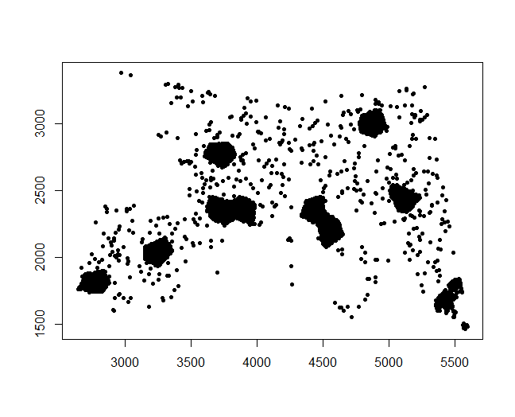

# Synthetic Cases generation

You will find the R script for generating random clustered data adapted from "Dealing with clustered samples for assessing map accuracy by  cross-validation" by de Bruin et al. (2022). The analysis is focused on soil organic carbon stock (OCS) with maps covering western Europe. See further details [here](https://doi.org/10.1016/j.ecoinf.2022.101665).

The geotiff and shapefiles to run the R script can be downloaded [here](https://doi.org/10.5281/zenodo.6513429).

See an example of random realisation for strongly clustered data .
See an example of random realisation for moderately clustered data .
